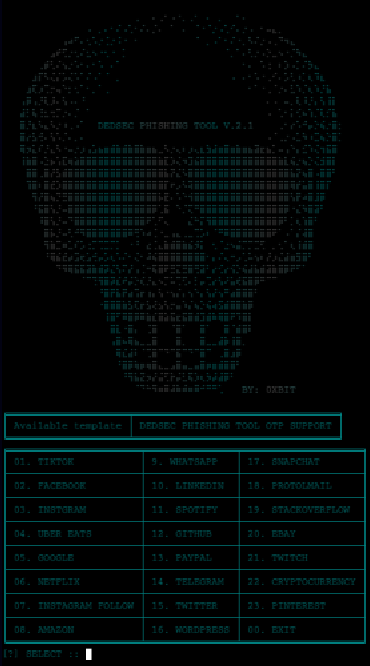

<h1 align="center"> DEDSEC_PHISH</h1>
<h4 align="center"> DEDSEC_PHISH is a powerful and versatile solution designed for ethical hacking and security testing purposes. It is equipped with advanced features to replicate real-world scenarios, including support for OTP (One-Time Password) data.</h4>

### TECHNIQUE
When a victim enters their credentials, you should access the original website and use those credentials to generate and send a legitimate OTP to the victim. Once the victim enters that OTP, you will also have it, giving you the ability to access the account before they do.

### INSTALLATION [ KALI ]
* git clone https://github.com/0xbitx/DEDSEC_PHISH.git
* cd DEDSEC_PHISH
* sudo pip3 install pystyle
* chmod +x dedsec_phish
* sudo ./dedsec_phish

### TUNNELLING
* CLOUDFLARED

### TESTED ON FOLLOWING
* Kali Linux 
* Parrot OS
* Ubuntu
* Arch Linux
* Termux App (rooted phone)
  
### PREREQUISITES
* sudo - [ MUST ]
* php

### LANGUAGE 
* Python

## Support

If you find my work helpful and want to support me, consider making a donation. Your contribution will help me continue working on open-source projects.

**Bitcoin Address: `36ALguYpTgFF3RztL4h2uFb3cRMzQALAcm`**
                         

### DISCLAIMER
                                       TO BE USED FOR EDUCATIONAL PURPOSES ONLY

The use of the DEDSEC_PHISH is COMPLETE RESPONSIBILITY of the END-USER. Developers assume NO liability and are NOT responsible for any misuse or damage caused by this program. 
